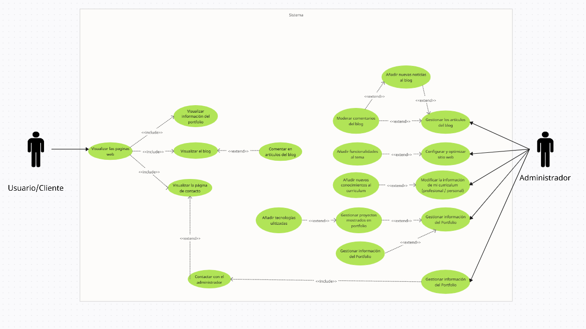

# **MyPortfolio | Portfolio Personal en WordPress**

## **1. Introducción**

Este documento explica los detalles básicos del proyecto **Portfolio Personal en WordPress**. Su objetivo es definir qué se va a hacer, cómo se va a hacer y qué se necesita para completarlo. Además, proporciona un marco de referencia para futuras modificaciones y mejoras en el desarrollo del sitio.

**Nota:** Ninguno de los contenidos que se presentan a continuación representa una fase final del proyecto. A medida que avance el desarrollo, podrán ser modificados o ajustados según sea necesario.

## **2. Objetivo del Proyecto**

El proyecto consiste en la creación de un **portafolio web personal**, que será una herramienta para mostrar mi trabajo y conocimientos en desarrollo web. Este portafolio digital servirá como una carta de presentación en línea y permitirá visualizar mi evolución profesional y proyectos desarrollados.

El sitio incluirá documentación sobre cada proyecto, enlaces a repositorios de código y demostraciones del proyecto. Así, ofrecerá información relevante tanto para empleadores como para otros desarrolladores interesados en mi trabajo.

El portafolio será dinámico y fácil de actualizar, permitiendo la incorporación de nuevas habilidades y proyectos. Además, se aplicarán estrategias básicas de **SEO** únicamente por disfrute personal, sin que esto sea un requisito esencial en la estructura del sitio.

Su propósito es:

- Presentar mi experiencia y habilidades en desarrollo web o en otras áreas de manera estructurada y visualmente atractiva.
- Mostrar los proyectos en los que he trabajado y en los que sigo trabajando, incluyendo detalles técnicos y aprendizajes obtenidos.
- Facilitar la interacción y conocimiento de mi persona a empresarios u empresas del sector.
- Hacer que el sitio sea fácil de actualizar y mejorar con el tiempo, permitiendo incorporar nuevas secciones o funcionalidades según sea necesario.

## **3. Alcance del Proyecto**

- **Uso de WordPress:** Se utilizará WordPress como plataforma para administrar el contenido, permitiendo una gestión sencilla y flexible.
- **Construcción desde cero:** Se creará una plantilla personalizada para WordPress completamente desde cero, sin el uso de maquetadores visuales como Elementor.
- **Estructura del sitio:**
  - Página principal con información destacada, incluyendo una introducción breve y enlaces rápidos a las secciones más relevantes.
  - Sección "Sobre mí" con detalles personales, formación académica, certificaciones y experiencia laboral.
  - Página de proyectos con imágenes, descripciones, enlaces a repositorios y tecnologías utilizadas.
  - Sección de contacto con formulario, redes sociales y dirección de correo electrónico.
  - Posible integración de un blog donde se compartirán artículos, avances de proyectos o conocimientos adquiridos.
  - _Posibilidad de incluir nuevas funcionalidades a medida que vaya desarrollándose el proyecto._
- **Optimización SEO:** Se aplicarán estrategias básicas de SEO sin que esto sea un factor primordial en la construcción del sitio.
- **Seguridad y mantenimiento:** Se utilizarán plugins de seguridad para proteger la web, pero no se desarrollarán medidas de seguridad personalizadas desde cero.

## **4. Requisitos Técnicos**

### **4.1. Herramientas y Tecnologías**

- **Lenguajes:** HTML, CSS, JavaScript, PHP.
- **Base de Datos:** MySQL (manejado por WordPress).
- **Plugins esenciales:**
  - WPForms para formularios de contacto.
  - Wordfence o similar para seguridad.
  - Yoast SEO o Rank Math para posicionamiento en buscadores.
  - WP Rocket para mejorar la velocidad del sitio.
  - WPML o Polylang para traducción opcional.
  - BackWPup o UpdraftPlus para copias de seguridad automatizadas.
  - Google Analytics para monitorear el tráfico del sitio | _parte opcional, en todo caso se realizara si veo que puede estar interesante, si no no será implementado._

### **4.2. Hosting y Dominio**

- Todavía no está definido cómo se realizará la elección del hosting, pero se están explorando múltiples opciones para garantizar la mejor solución. Como alternativa, se puede comenzar trabajando en un entorno **LOCAL**, lo que permitirá desarrollar y probar la web con calma antes de decidir el servidor definitivo que se utilizará.

## **5. Metodología de Desarrollo**

El proyecto se desarrollará en varias etapas, asegurando una implementación estructurada y organizada:

- **Fase 1: Planificación**
  - Diseñar la estructura del sitio y definir su contenido.
  - Elegir las herramientas necesarias y planificar la arquitectura del sitio.
  - Crear bocetos y prototipos iniciales del diseño.
- **Fase 2: Desarrollo**
  - Instalar y configurar WordPress en un entorno de prueba.
  - Crear las páginas y configurar las funciones necesarias.
  - Construir la plantilla de WordPress completamente desde cero, sin maquetadores visuales.
  - Implementar funcionalidades interactivas como formularios de contacto y galerías dinámicas.
- **Fase 3: Pruebas y Optimización**
  - Comprobar que el sitio funciona bien en distintos dispositivos y navegadores.
  - Aplicar mejoras en SEO a modo de experimentación y aprendizaje (no es necesario pero se realizara en todo caso por puro aprendizaje y diversion).
  - Optimizar el rendimiento del sitio mediante compresión de imágenes o cualquier ajuste que mejore la velocidad de nuestro sitio.
  - Realizar pruebas de seguridad mediante plugins especializados si fuera necesario.
- **Fase 4: Publicación**
  - Subir el sitio al hosting definitivo y configurar el dominio.
  - Realizar ajustes finales y pruebas en el entorno en vivo.

## **6. Consideraciones Finales**

Este documento es una versión inicial de la definición del proyecto. A medida que se avance en el desarrollo, se podrán hacer cambios y mejoras para ajustarlo mejor a las necesidades. Se actualizará conforme se detecten nuevas oportunidades de mejora, asegurando que el sitio crezca y evolucione junto con la experiencia y los requerimientos del usuario.

## **Casos de Uso \- Portfolio Personal en WordPress**

### **Introducción**

Este documento define los casos de uso del proyecto Portfolio Personal en WordPress. La web no contará con sistema de autenticación ni funcionalidades que requieran registro de usuarios. Se identifican dos tipos de actores principales:

- Usuarios (Anónimos): Visitantes que navegan el sitio sin necesidad de registro. Pueden interactuar con ciertas secciones de la web, como leer el blog y dejar comentarios.
- Admin: El administrador del sitio, responsable de gestionar todo el contenido y la configuración del portafolio.

---

### **Casos de Uso para Usuarios Anónimos**

#### **CU-01: Navegar por el sitio web**

Actor: Usuario (Anónimo) Descripción: El usuario puede acceder a la web y navegar por sus distintas secciones. Flujo principal:

1. El usuario accede a la web a través de un navegador.
2. Puede visualizar el contenido del portafolio, incluyendo la sección "Sobre mí", "Proyectos" y "Blog".
3. Puede interactuar con enlaces de redes sociales proporcionados en la web.
4. Fin del caso de uso.

---

#### **CU-02: Visualizar la información del portfolio**

Actor: Usuario (Anónimo) Descripción: El usuario puede acceder a la información sobre el propietario del portafolio. Flujo principal:

1. El usuario accede a la sección "Sobre mí" o "Proyectos".
2. Se muestra información personal y profesional del administrador.
3. Puede leer sobre la trayectoria, habilidades y proyectos realizados.
4. Fin del caso de uso.

---

#### **CU-03: Visualizar el blog**

Actor: Usuario (Anónimo) Descripción: El usuario puede acceder y leer los artículos publicados en la sección del blog. Flujo principal:

1. El usuario accede a la sección "Blog".
2. Se muestra una lista de artículos publicados.
3. El usuario selecciona un artículo para leer su contenido.
4. Puede regresar a la lista de artículos o seguir navegando por la web.
5. Fin del caso de uso.

---

#### **CU-04: Comentar en artículos del blog**

Actor: Usuario (Anónimo) Descripción: El usuario puede dejar comentarios en los artículos del blog sin necesidad de registro. Flujo principal:

1. El usuario accede a un artículo en la sección "Blog".
2. En la parte inferior del artículo, encuentra un formulario de comentarios.
3. Escribe un comentario y lo envía.
4. El sistema guarda el comentario y lo muestra en la sección de comentarios.
5. Fin del caso de uso.

---

#### **CU-05: Visualizar la página de contacto**

Actor: Usuario (Anónimo) Descripción: El usuario puede acceder y leer la sección de contacto de nuestro portfolio para contactar con el administrador (nosotros). También podrá contactar con el administrador a través de algún otro bloque / widget de contacto disponible en el footer del portfolio. Flujo principal:

1. El usuario accede a la sección de “Contacto”.
2. Se muestra un apartado de contacto para introducir los datos de contacto personales de la entidad o persona, junto al motivo del contacto.
3. El usuario puede introducir los datos de contacto o puede seguir navegando por la web sin tener la obligación de responder.
4. Fin del caso de uso

---

#### **CU-06: Contactar al administrador**

Actor: Usuario (Anónimo) Descripción: El usuario puede enviar un mensaje al administrador a través del formulario de contacto. Flujo principal:

1. El usuario accede a la sección "Contacto".
2. Completa el formulario con su nombre, email y mensaje.
3. Envía el formulario.
4. El administrador recibe el mensaje por correo electrónico.
5. Fin del caso de uso.

---

### **Casos de Uso para el Administrador**

#### **CU-07: Gestionar información del portfolio**

Actor: Admin Descripción: El administrador puede editar la información del portfolio (biografía, experiencia, habilidades, etc.). Flujo principal:

1. El administrador accede al panel de administración de WordPress.
2. Selecciona la sección "Sobre mí" o "Proyectos".
3. Edita los textos e imágenes correspondientes.
4. Guarda los cambios y verifica la actualización en el sitio público.
5. Fin del caso de uso.

---

#### **CU-08: Gestionar los proyectos mostrados en el portafolio**

Actor: Admin Descripción: El administrador puede agregar, editar o eliminar proyectos del portafolio. Flujo principal:

1. El administrador accede al panel de WordPress.
2. Navega a la sección "Proyectos".
3. Puede agregar un nuevo proyecto, modificar uno existente o eliminar un proyecto.
4. Guarda los cambios y verifica la actualización en la web pública.
5. Fin del caso de uso.

---

#### **CU-09: Gestionar los artículos del blog**

Actor: Admin Descripción: El administrador puede escribir, editar o eliminar artículos del blog. Flujo principal:

1. El administrador accede a la sección "Entradas" en el panel de administración.
2. Puede agregar un nuevo artículo, modificar uno existente o eliminar un artículo.
3. Guarda los cambios y verifica que se reflejen en la web.
4. Fin del caso de uso.

---

#### **CU-10: Moderar comentarios en el blog**

Actor: Admin Descripción: El administrador puede aprobar, eliminar o marcar como spam los comentarios realizados por los usuarios en los artículos del blog. Flujo principal:

1. El administrador accede a la sección "Comentarios" en el panel de WordPress.
2. Revisa los comentarios pendientes de aprobación.
3. Puede aprobar, responder, eliminar o marcar comentarios como spam.
4. Fin del caso de uso.

---

#### **CU-11: Configurar y optimizar el sitio web**

Actor: Admin Descripción: El administrador puede realizar ajustes en la configuración del sitio, instalar plugins y optimizar el rendimiento. Flujo principal:

1. El administrador accede a la configuración de WordPress.
2. Ajusta parámetros del sitio, como título, descripciones, enlaces permanentes, etc.
3. Puede instalar y configurar plugins para mejorar la seguridad, SEO y rendimiento.
4. Guarda los cambios y verifica que el sitio funcione correctamente.
5. Fin del caso de uso.

---

#### **CU-12: Modificar la información personal**

Actor: Admin Descripción: El administrador puede actualizar su información personal, incluyendo currículum vitae, lugar de residencia, información de contacto, nombre y apellidos. Flujo principal:

1. El administrador accede al panel de administración de WordPress.
2. Selecciona la sección de información personal.
3. Edita los campos necesarios.
4. Guarda los cambios y verifica la actualización en el sitio público.
5. Fin del caso de uso.

---

#### **CU-13: Añadir funcionalidades al tema**

Actor: Admin Descripción: El administrador puede agregar nuevas funcionalidades al tema de WordPress "MyPortfolio" desarrollado para la web. Flujo principal:

1. El administrador accede al código fuente del tema.
2. Modifica o agrega funcionalidades necesarias.
3. Prueba las nuevas funcionalidades en un entorno de desarrollo.
4. Implementa los cambios en el entorno de producción.
5. Fin del caso de uso.

---

#### **CU-14: Añadir tecnologías utilizadas o conocimientos adquiridos**

Actor: Admin Descripción: El administrador puede actualizar la lista de tecnologías utilizadas y conocimientos adquiridos en su trayectoria profesional. Flujo principal:

1. El administrador accede a la sección de tecnologías o conocimientos.
2. Añade, edita o elimina elementos de la lista.
3. Guarda los cambios y revisa la actualización en la web.
4. Fin del caso de uso.

---

#### **CU-15: Publicar artículos en el apartado noticias**

Actor: Admin Descripción: El administrador puede publicar artículos en el blog sobre nuevas noticias relacionadas con su vida profesional o logros. Flujo principal:

1. El administrador accede a la sección "Entradas" en el panel de administración.
2. Crea una nueva entrada y escribe el contenido.
3. Guarda y publica el artículo.
4. Verifica la correcta visualización en la web.
5. Fin del caso de uso.

---

#### **CU-16: Responder a entidades o personas que contacten al administrador**

Actor: Admin Descripción: El administrador puede responder manualmente a mensajes recibidos a través del formulario de contacto (esta acción no forma parte de la web en sí, pero es parte del flujo de interacción). Flujo principal:

1. El administrador recibe una notificación de contacto.
2. Revisa el mensaje recibido en su correo electrónico.
3. Decide si responde o toma alguna acción basada en el mensaje.
4. Fin del caso de uso.

---

#### **CU-17: Modificar el apartado de FAQ's**

Actor: Admin Descripción: El administrador puede modificar la sección de preguntas frecuentes en función de las dudas recibidas sobre su trabajo o su perfil. Flujo principal:

1. El administrador accede a la sección de FAQ's en el panel de administración.
2. Añade, edita o elimina preguntas y respuestas.
3. Guarda los cambios y verifica que se reflejen en la web.
4. Fin del caso de uso.

## **Diagrama de Casos de Uso**

Este apartado presenta los **diagramas de casos de uso** del proyecto **Portfolio Personal en WordPress**. Estos diagramas permiten visualizar de manera estructurada las interacciones entre los distintos actores del sistema y las funcionalidades que pueden realizar dentro del sitio web.

A continuación, se presentan los diagramas de casos de uso correspondientes a cada actor, detallando sus interacciones dentro del sistema.

Diagrama de casos de uso:

## **Planificación de las Versiones y Estructura del Proyecto**

### **Introducción**

Este documento tiene como objetivo definir las **versiones del proyecto** y la organización de tareas para gestionar de manera eficiente el desarrollo del **Portfolio Personal en WordPress**. La planificación estructurada garantizará un avance progresivo y un control adecuado de cada fase del proyecto.

### **Objetivo**

Como desarrollador, quiero definir las versiones del proyecto y organizar sus tareas para gestionar de manera eficiente el desarrollo, asegurando que cada fase cumpla con los objetivos establecidos y permitiendo futuras mejoras o expansiones.

### **Estructura del Proyecto**

El proyecto estará estructurado en distintas versiones, basadas en las historias de usuario y los sprints definidos previamente, asegurando una evolución progresiva del desarrollo.

#### **Versiones Planificadas**

#### **Versión 1.0: Inicio y Planificación (Febrero \- Marzo 2025\)**

- Definición de requisitos iniciales.
- Elaboración de casos de uso y diagramas de flujo.
- Planificación de versiones y estructura del proyecto.
- Creación de bocetos iniciales.

#### **Versión 1.1: Diseño y Conceptualización (Marzo 2025\)**

- Elaboración de wireframes y mockups.
- Creación de la guía de estilos.
- Definición del entorno de desarrollo.
- Configuración del repositorio en GitHub.

#### **Versión 1.2: Desarrollo de la Base del Proyecto (Marzo \- Abril 2025\)**

- Creación de la estructura base del tema de WordPress desde cero.
- Implementación del sistema de rutas y archivos principales.
- Configuración de la base de datos en MySQL.
- Diseño inicial de la base de datos y relaciones.

#### **Versión 1.3: Desarrollo de la Interfaz y Funcionalidades Iniciales (Abril 2025\)**

- Desarrollo de la plantilla HTML y estructura general del sitio.
- Implementación del header y footer personalizados.
- Creación de la página de inicio con contenido dinámico.
- Implementación de la página "Sobre mí" con datos configurables.

#### **Versión 1.4: Desarrollo de las Secciones Clave (Abril \- Mayo 2025\)**

- Creación de la sección de proyectos con estructura dinámica.
- Implementación de formularios de contacto con validaciones básicas.
- Desarrollo de las secciones de navegación y menú adaptable.
- Configuración de plugins esenciales para la web (seguridad, SEO básico, formularios).

#### **Versión 1.5: Optimización y Seguridad (Mayo 2025\)**

- Aplicación de estrategias de optimización de rendimiento.
- Implementación de medidas básicas de seguridad mediante plugins.
- Optimización de la velocidad de carga y caché.
- Pruebas en distintos dispositivos y navegadores.

#### **Versión 1.6: Pruebas Finales y Ajustes (Mayo 2025\)**

- Test de usuario y evaluación de la experiencia de navegación.
- Corrección de errores y ajustes de última hora.
- Implementación de mejoras en diseño y funcionalidad.
- Preparación de la documentación para la presentación.

#### **Versión 2.0: Despliegue y Presentación (Junio 2025\)**

- Migración del sitio a un servidor definitivo.
- Pruebas finales en producción.
- Verificación de funcionalidades post-despliegue.
- Preparación y presentación final del proyecto.

### **Metodología de Desarrollo**

Para asegurar un desarrollo ordenado y eficiente, el proyecto se desarrollará siguiendo los siguientes principios:

1. **Desarrollo incremental:** Cada versión agregará nuevas funcionalidades sobre la base anterior.
2. **Uso de Git y GitHub:** Se utilizarán ramas separadas cuando se trabaje codigo dentro del proyecto para cada versión, facilitando la organización y colaboración.
3. **Pruebas y optimización:** Antes de finalizar cada versión, se realizarán pruebas de compatibilidad y rendimiento.

### **Conclusión**

La planificación de versiones y la estructura del proyecto permitirán desarrollar el **Portfolio Personal en WordPress** de forma escalonada, asegurando un resultado funcional y bien optimizado para su entrega y uso futuro.
